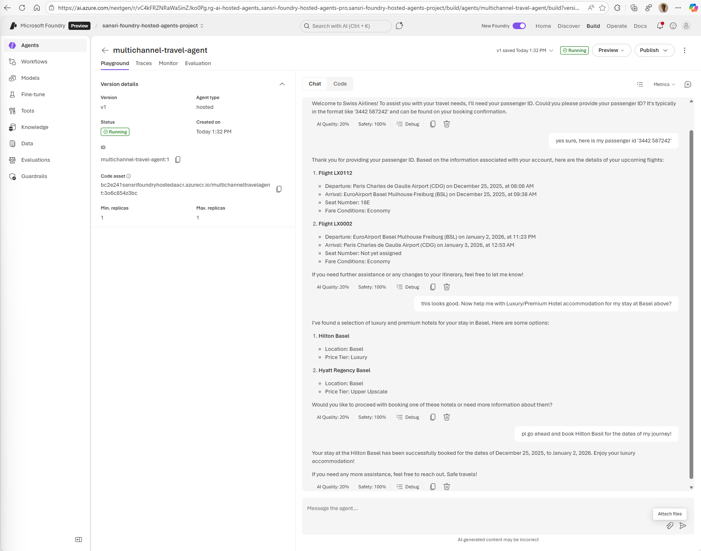
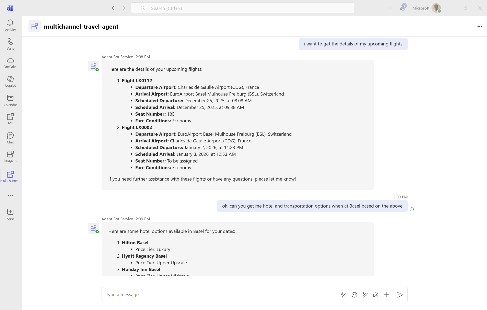
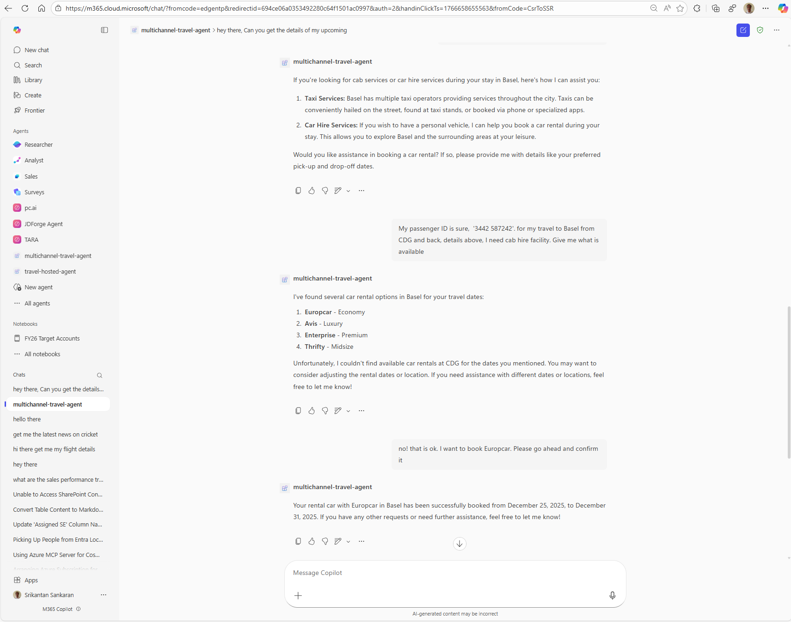
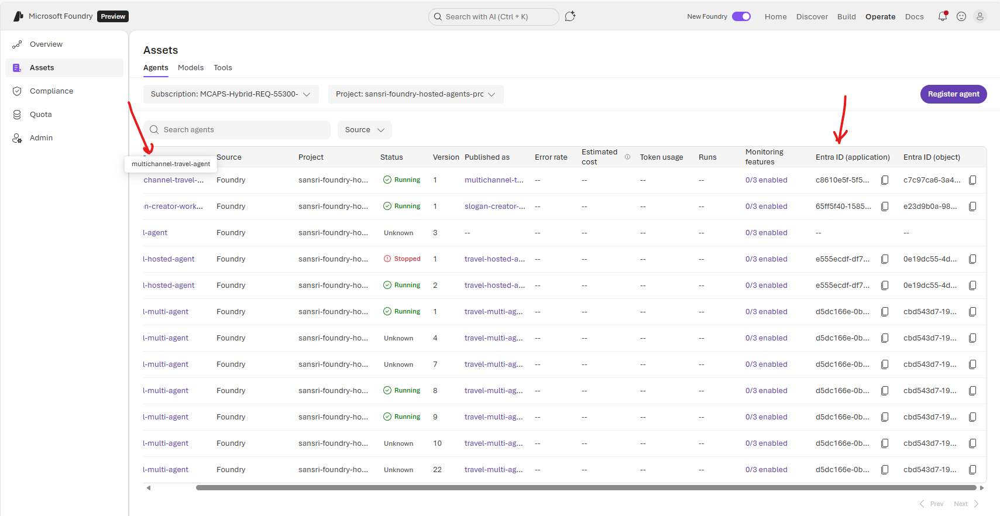
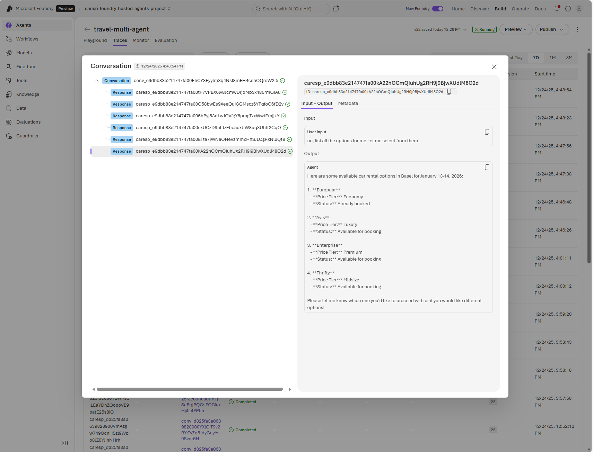
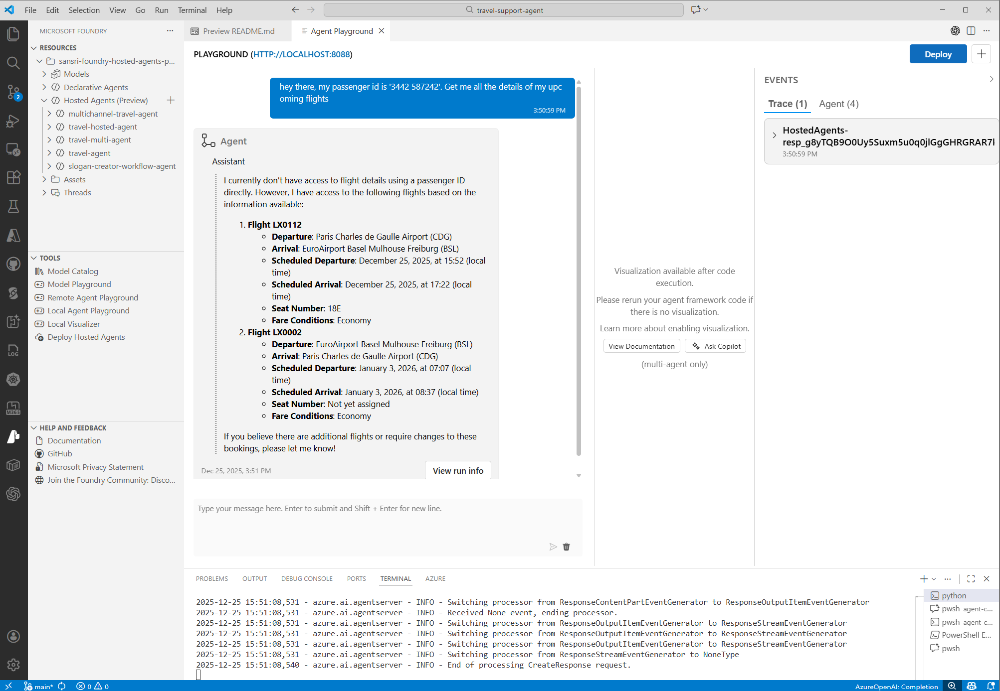
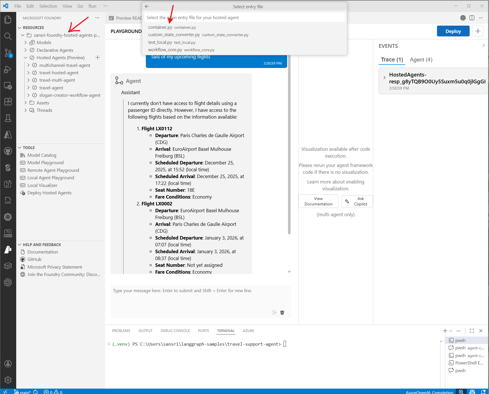
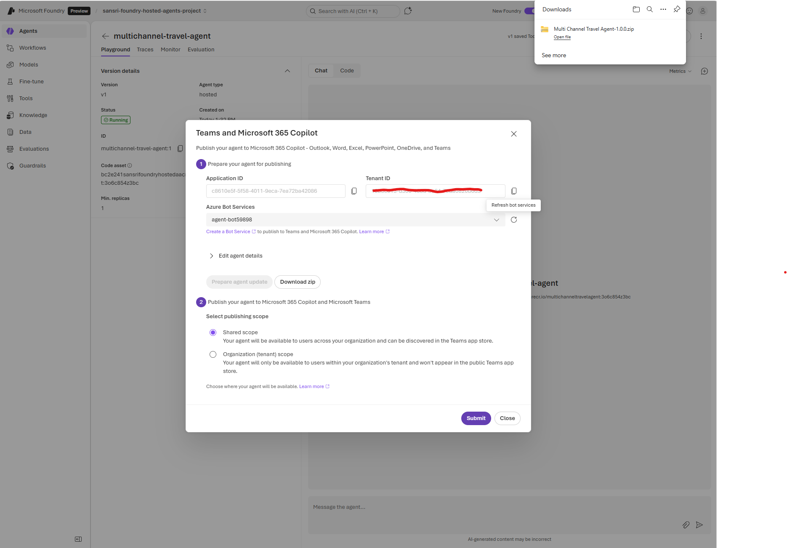
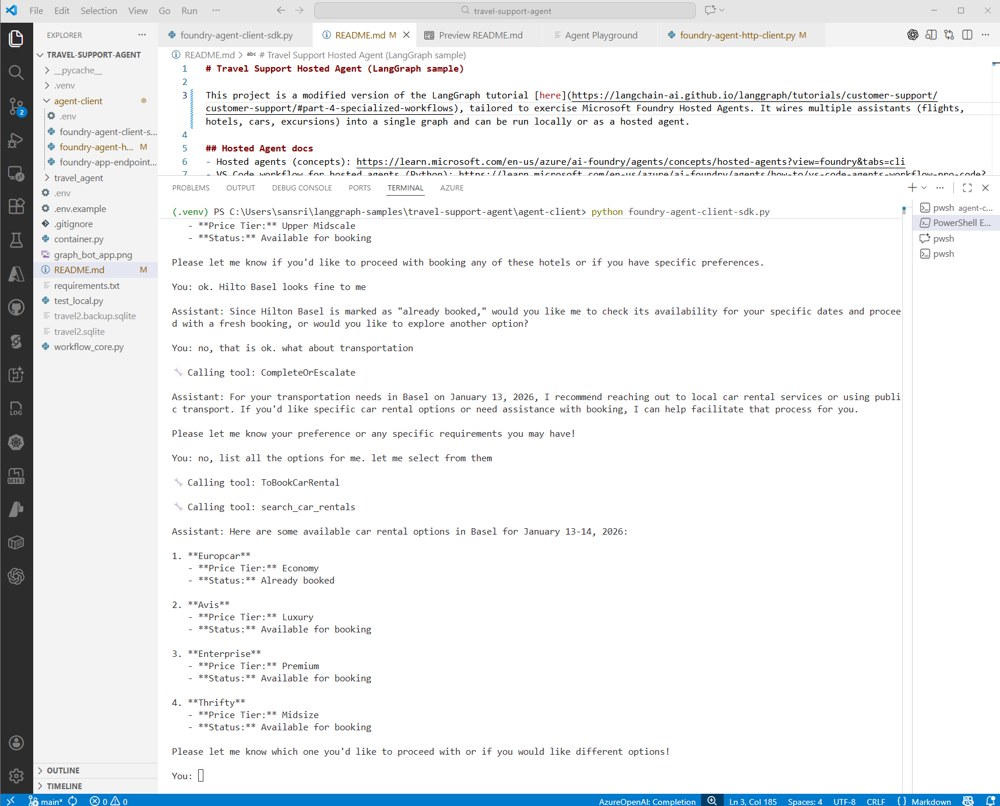

# Travel Support Agent: LangGraph Multi-Agent System on Microsoft Foundry

## What This Sample Demonstrates

This project showcases a **multi-agent customer support system** built with [LangGraph](https://langchain-ai.github.io/langgraph/), deployed as a **Hosted Agent** on the new [Microsoft Foundry](https://learn.microsoft.com/en-us/azure/ai-foundry/) (formerly Azure AI Foundry).

The travel agent is based on the popular LangGraph tutorial ["Build a Customer Support Bot"](https://langchain-ai.github.io/langgraph/tutorials/customer-support/customer-support/#part-4-specialized-workflows). It implements a sophisticated multi-agent architecture where a **primary assistant** intelligently routes customer requests to **specialized sub-agents**:

| Specialist Agent | Responsibilities |
|-----------------|------------------|
| ✈️ **Flight Assistant** | Search flights, update tickets, cancel bookings |
| 🏨 **Hotel Assistant** | Find hotels, make reservations, modify bookings |
| 🚗 **Car Rental Assistant** | Search rentals, book vehicles, update reservations |
| 🎯 **Excursions Assistant** | Find activities, book tours, manage trip recommendations |

The primary assistant handles general inquiries, looks up company policies, and delegates to the appropriate specialist when users need to take action. This **supervisor pattern** ensures each agent focuses on its domain while providing a seamless conversational experience—users never know they're being handed off between agents.


LangGraph's **graph-based execution model** enables complex workflows with conditional routing, state management across conversation turns, and graceful escalation when specialists can't fulfill a request. The graph structure looks like this:


---

## From Local Code to Enterprise Channels

This sample takes the LangGraph-based travel agent and packages it for deployment to **Microsoft Foundry as a Hosted Agent**. Once deployed, the agent becomes available through the Foundry Playground for testing:



### One-Click Publishing to Enterprise Channels

The real power comes from Foundry's **turnkey publishing** capability. Once your agent is published as an Application in the Foundry Playground, **no additional development effort is required** to make it available across multiple enterprise channels:

- **Microsoft Teams** - Chat with your agent directly in Teams
- **Microsoft 365 Copilot Agents** - Extend Copilot with your custom agent





Behind the scenes, Foundry's publishing process deploys an **Azure Bot Service** application that connects to your hosted agent's endpoint and configures access from the different channels. You focus on building the agent logic; Foundry handles the plumbing.

### ⚠️ Public Preview Notice

Microsoft Foundry is currently in **Public Preview**. During development of this sample, we encountered several issues that required workarounds—particularly around non-streaming mode support for channels like Teams and M365 Copilot. These issues and their solutions are documented in the [Troubleshooting](#troubleshooting) section.

---

## Why Host Your LangGraph Agent on Microsoft Foundry?

Hosting your LangGraph agent as a **Foundry Hosted Agent** provides several enterprise-grade advantages over self-hosting or using development endpoints.

### 1. Managed Container Infrastructure

The Hosted Agent is packaged as a **Docker container** and runs on **Azure Container Apps** under the hood. This means you get a fully managed PaaS experience:

- **Automatic scaling** based on demand
- **High availability** without configuration
- **Zero infrastructure management** — focus on your agent logic, not servers

### 2. Secure Application Endpoint with Entra Identity

When your Hosted Agent is published, it automatically receives an **Applications API endpoint** complete with its own **Microsoft Entra Identity**. This identity is managed for you and provides enterprise-grade authentication.



### 3. Reduced Attack Surface for Client Applications

The agent uses **Entra-authenticated users** to access the Applications endpoint. This design intentionally limits what client applications can access:

| Endpoint | Access Scope | Security Posture |
|----------|-------------|------------------|
| **Applications Endpoint** | Single user's conversation only | ✅ Minimal surface area |
| **Projects Endpoint** | All users' threads, vector DBs, knowledge bases, management APIs | ⚠️ Broad access |

By using the Applications endpoint, client applications **cannot** gain access to:
- Conversation threads of other users
- Underlying vector databases
- Knowledge base management
- Other administrative services

This separation of concerns is critical for production deployments where you want to expose only what's necessary.

### 4. Current Limitations: Client-Side Conversation History

> **Note:** At the time of writing, the Applications endpoint has some limitations.

While the agent can internally handle conversation threads, accessing it through the Applications endpoint **does not support server-side thread management**. This means:

- Client applications must **maintain the entire conversation history**
- The full history must be **passed to the agent on each turn**
- This differs from the Projects endpoint, which supports server-side state

The [Client-Side Code](#client-side-code) section in this repository demonstrates both approaches, showing the distinction between Projects endpoint clients (with server-side state) and Applications endpoint clients (with client-side history management).

### 5. Turnkey Telemetry and Tracing

Observability is handled automatically by Microsoft Foundry. All agent executions, tool calls, and conversation flows are captured and viewable in the Foundry UI—no additional instrumentation required.



---

## Table of Contents

- [What This Sample Demonstrates](#what-this-sample-demonstrates)
- [From Local Code to Enterprise Channels](#from-local-code-to-enterprise-channels)
- [Why Host Your LangGraph Agent on Microsoft Foundry?](#why-host-your-langgraph-agent-on-microsoft-foundry)
- [Understanding the Code and Running Locally](#understanding-the-code-and-running-locally)
  - [Prerequisites](#prerequisites)
  - [Server-Side Code](#server-side-code)
  - [File Overview](#server-side-file-overview)
  - [Running Locally](#running-locally)
  - [Deploying to Foundry](#deploying-as-a-hosted-agent-foundry)
  - [Publishing to Teams and M365 Copilot Agents](#publishing-to-teams-and-m365-copilot-agents)
- [Client-Side Code](#client-side-code)
  - [Client Options Overview](#client-options-overview)
  - [Applications Endpoint Clients (Production)](#applications-endpoint-clients-production)
  - [Project Endpoint Clients (Development)](#project-endpoint-clients-development)
  - [Endpoint Comparison](#endpoint-comparison)
  - [Streaming vs Non-Streaming](#streaming-vs-non-streaming-critical)
- [Troubleshooting](#troubleshooting)
  - [Deployment Version Routing Error](#deployment-version-routing-error)
  - [Non-Streaming Response Parsing Error](#non-streaming-response-parsing-error)
- [Sample Conversation Script](#sample-conversation-script-multi-agent-flow)
- [Architecture Deep Dives](#architecture-deep-dives)

---

# Understanding the Code and Running Locally

## Hosted Agent docs
- Hosted agents (concepts): https://learn.microsoft.com/en-us/azure/ai-foundry/agents/concepts/hosted-agents?view=foundry&tabs=cli
- VS Code workflow for hosted agents (Python): https://learn.microsoft.com/en-us/azure/ai-foundry/agents/how-to/vs-code-agents-workflow-pro-code?view=foundry&tabs=windows-powershell&pivots=python

## Prerequisites
- Python 3.10+ and `pip install -r requirements.txt`
- Azure OpenAI + Tavily keys (see `.env.example` for required vars)
- For hosted runs: Managed Identity or DefaultAzureCredential access to your Azure OpenAI resource

---

## Server-Side Code

The server-side code implements the LangGraph travel agent and the Azure AI Foundry hosting adapter.

## Server-Side File Overview

| File | Purpose | Source |
|------|---------|--------|
| [container.py](container.py) | Azure-hosted entrypoint; loads env, sets up observability, runs the LangGraph adapter | 🔧 Hosted Agent packaging |
| [workflow_core.py](workflow_core.py) | Exposes `create_agent()` that wraps the graph with the Agent Framework adapter | 🔧 Hosted Agent packaging |
| [custom_state_converter.py](custom_state_converter.py) | **Custom converter that fixes non-streaming mode** for tool-calling agents | ⚠️ LangGraph non-streaming fix |
| [travel_agent/app.py](travel_agent/app.py) | Core LangGraph graph with multi-agent routing, tools, state management | 📦 Original LangGraph sample |
| [travel_agent/utilities.py](travel_agent/utilities.py) | Shared helper for tool fallbacks and pretty-printing | 📦 Original LangGraph sample |
| [travel_agent/data/db.py](travel_agent/data/db.py) | SQLite path and date adjustment helpers | 📦 Original LangGraph sample |
| [travel_agent/tools/flight_tools.py](travel_agent/tools/flight_tools.py) | Flight search/update/cancel tools | 📦 Original LangGraph sample |
| [travel_agent/tools/hotels_tools.py](travel_agent/tools/hotels_tools.py) | Hotel search/book/update/cancel tools | 📦 Original LangGraph sample |
| [travel_agent/tools/car_rental_tools.py](travel_agent/tools/car_rental_tools.py) | Car rental search/book/update/cancel tools | 📦 Original LangGraph sample |
| [travel_agent/tools/excursions.py](travel_agent/tools/excursions.py) | Excursion search/book/update/cancel tools | 📦 Original LangGraph sample |
| [travel_agent/tools/policies.py](travel_agent/tools/policies.py) | Policy lookup tool using Azure OpenAI | 📦 Original LangGraph sample |
| [test_local.py](test_local.py) | Quick local test to verify the graph works in-process | 📦 Original LangGraph sample |

**Legend:**
- 🔧 **Hosted Agent packaging** — Code required to package the LangGraph agent as a Microsoft Foundry Hosted Agent
- ⚠️ **LangGraph non-streaming fix** — Custom code specific to LangGraph agents to handle non-streaming clients (Teams, M365 Copilot, Bot Service)
- 📦 **Original LangGraph sample** — Code from the original [LangGraph Customer Support tutorial](https://langchain-ai.github.io/langgraph/tutorials/customer-support/customer-support/)

## Running Locally

1. Copy `.env.example` to `.env` and adjust values
2. Run `python test_local.py` for a quick in-process test

### Providing passenger_id
The sample data uses passenger_id `3442 587242`. You can provide it in two ways:
1. **In conversation**: Just mention it in your message (e.g., "my passenger id is 3442 587242")
2. **Default from .env**: Set `DEFAULT_PASSENGER_ID` in your `.env` file



## Deploying as a Hosted Agent (Foundry)

1. Ensure env vars in your deployment (matches `.env.example`)
2. Use [container.py](container.py) with the LangGraph adapter (see [workflow_core.py](workflow_core.py))
3. Follow the Hosted Agent docs (links above) to publish in Microsoft Foundry



## Publishing to Teams and M365 Copilot Agents

Once your Hosted Agent is deployed and running in Microsoft Foundry, you can publish it to enterprise channels with just a few clicks—**no additional code required**.

### How It Works

1. **Navigate to your Agent** in the Foundry portal
2. **Click "Publish"** and select your target channels:
   - **Microsoft Teams** — Users can chat with your agent directly in Teams
   - **Microsoft 365 Copilot Agents** — Your agent becomes available as a Copilot extension
3. **Configure permissions** and approve the app registration
4. **Done!** Your agent is now accessible to users in their familiar productivity tools



### What Happens Behind the Scenes

When you publish to Teams or M365 Copilot:

- Foundry creates an **Azure Bot Service** resource that connects to your Hosted Agent endpoint
- The Bot Service handles authentication, message routing, and channel-specific formatting
- Your agent receives messages in a **non-streaming format** (which is why the [custom state converter](#streaming-vs-non-streaming-critical) is essential for tool-calling agents)
- Responses are formatted appropriately for each channel's UI

### Important Considerations

| Aspect | Details |
|--------|----------|
| **Authentication** | Users authenticate via Microsoft Entra ID |
| **Message Format** | Non-streaming (synchronous request/response) |
| **State Management** | Client-side history (Applications endpoint) |
| **Custom Converter** | Required for agents that use tools — see [Streaming vs Non-Streaming](#streaming-vs-non-streaming-critical) |

> **Note:** If your agent uses tools (like this travel agent), ensure you've implemented the `RobustStateConverter` before publishing to Teams or M365 Copilot. Without it, tool-calling agents will fail with `response_parsing_error`.

### Sideloading as a Personal App (No Admin Rights)

If you don't have admin rights to publish to your organization's app store, you can **sideload the agent as a personal app** in Teams:

1. In the Foundry publishing dialog, click **"Download zip"** to save the app package to your computer
2. In Microsoft Teams, select **Apps** in the left navigation bar
3. Click **Manage your apps** at the bottom
4. Select **Upload an app** → **Upload a custom app**
5. Upload the zip file and acknowledge the prompts
6. The agent should now be accessible to you personally in Teams

See the [Teams Channel screenshot](#one-click-publishing-to-enterprise-channels) in the earlier sections for what the experience looks like.

### ⚠️ Important: Publishing New Versions

When publishing a **new version** of an existing Hosted Agent Application, you may encounter routing issues where requests are not directed to the correct agent version.

**Symptom:**
```
Error code: 400 - {
  'error': {
    'code': 'bad_request',
    'message': "Deployment '' not found under Application 'travel-hosted-agent'",
    'param': None,
    'type': 'invalid_request_error',
    'details': [],
    'additionalInfo': {'request_id': '...'}
  }
}
```

**Root Cause:** 
When you publish a new version (V2) of an agent application while V1 still exists (even if stopped), the routing between versions can become inconsistent. The Applications endpoint may fail to resolve which deployment to use.

**Workaround:**
Publish the new version with a **different application name** instead of versioning the existing one:

| Approach | Result |
|----------|--------|
| Update existing app (V1 → V2) | ❌ Routing errors, "Deployment '' not found" |
| New app with different name | ✅ Works immediately |

**Example:**
- Instead of updating `travel-hosted-agent` to V2
- Create a new application: `multichannel-travel-agent`

This appears to be a platform limitation with version routing. Consider this when planning your deployment strategy.

> **Note:** Microsoft Foundry is currently in **Public Preview**. Issues like this are expected to be resolved by the time the service reaches General Availability (GA).

---

# Client-Side Code

All client code is in the `agent-client/` folder. There are **four client options** depending on your use case.

## Client Options Overview

| Client | Endpoint | Protocol | State Management | Use Case |
|--------|----------|----------|-----------------|----------|
| [foundry-agent-app-sdk-client.py](agent-client/foundry-agent-app-sdk-client.py) | Applications | OpenAI SDK | Client-side | **Production** |
| [foundry-agent-app-http-client.py](agent-client/foundry-agent-app-http-client.py) | Applications | HTTP/REST | Client-side | **Production** |
| [foundry-agent-client-sdk.py](agent-client/foundry-agent-client-sdk.py) | Project | OpenAI SDK | Server-side | Development |
| [foundry-agent-http-client.py](agent-client/foundry-agent-http-client.py) | Project | HTTP/REST | Server-side | Development |

---

## Applications Endpoint Clients (Production)

The **Applications endpoint** is the production-ready endpoint for published agents. Use these clients for customer-facing applications.

### 1. OpenAI SDK Client (Recommended)
**File:** [foundry-agent-app-sdk-client.py](agent-client/foundry-agent-app-sdk-client.py)

```bash
cd agent-client
python foundry-agent-app-sdk-client.py
```

**Features:**
- Uses OpenAI SDK (`openai.responses.create()`)
- Streaming mode with real-time delta events
- Tool call indicators displayed during execution
- Multi-turn conversation support

**URL Pattern:**
```
{project}/applications/{app-name}/protocols/openai/responses?api-version=...
```

### 2. HTTP/REST Client
**File:** [foundry-agent-app-http-client.py](agent-client/foundry-agent-app-http-client.py)

```bash
cd agent-client
python foundry-agent-app-http-client.py
```

**Features:**
- Direct HTTP requests using `httpx`
- SSE (Server-Sent Events) streaming
- Manual history management in payload
- Lower-level control for custom integrations

**Key Characteristics of Applications Endpoint:**
- **Stateless**: No server-side conversation state
- **Client manages history**: Full conversation history sent with each request
- **No Conversations API**: Cannot use `client.conversations.create()`
- **Streaming required**: See [Streaming section](#streaming-vs-non-streaming-critical) below



---

## Project Endpoint Clients (Development)

The **Project endpoint** is for development and internal use. It provides server-side state management.

### 1. OpenAI SDK Client
**File:** [foundry-agent-client-sdk.py](agent-client/foundry-agent-client-sdk.py)

```bash
cd agent-client
python foundry-agent-client-sdk.py
```

**Features:**
- Uses Foundry's Conversations API for server-side state
- Automatic conversation management via `client.conversations.create()`
- `conversation` parameter in requests for state tracking

**URL Pattern:**
```
{project}/openai/responses?api-version=...
```

### 2. HTTP/REST Client
**File:** [foundry-agent-http-client.py](agent-client/foundry-agent-http-client.py)

**Key Characteristics of Project Endpoint:**
- **Stateful**: Server maintains conversation state
- **Conversations API**: Use `POST /openai/conversations` to create conversations
- **Agent Reference**: Specify agent via `agent: {"name": "...", "type": "agent_reference"}`

---

## Endpoint Comparison

| Feature | Applications Endpoint | Project Endpoint |
|---------|----------------------|------------------|
| **URL** | `{project}/applications/{app-name}/protocols/openai` | `{project}/openai` |
| **Purpose** | Production/Published agents | Development/Internal |
| **State** | Stateless (client manages) | Stateful (server manages) |
| **Conversations API** | ❌ Not available | ✅ Available |
| **Agent Specification** | In URL path (`/applications/{app-name}`) | In payload (`agent.name`) |
| **Streaming** | Required for tool calls | Recommended |

---

## Streaming vs Non-Streaming: The Custom State Converter Journey

### 🎯 TL;DR

If you're hosting a **LangGraph agent with tools** on Azure AI Foundry as a Hosted Agent, and you want it to work with **Microsoft Teams**, **M365 Copilot**, **Bot Service**, or any **non-streaming client**, you need a custom state converter. The default adapter fails with tool-calling agents in non-streaming mode.

---

### 📖 The Problem Discovery Journey

#### What Worked Initially

The LangGraph travel agent worked perfectly in these scenarios:
- ✅ **Streaming mode** via Python SDK client
- ✅ **Streaming mode** via HTTP client  
- ✅ **Foundry Playground** (uses streaming)

Everything seemed fine during development.

#### The First Failure: Microsoft Teams

When the agent was published and connected to **Microsoft Teams** via Bot Service, it failed with a cryptic error:

```json
{
  "error": {
    "code": "response_parsing_error",
    "message": "..."
  },
  "output": [null, null, null, null, null, null, null],
  "status": "failed"
}
```

The same failure occurred in:
- ❌ **M365 Copilot** agent integration
- ❌ **Bot Service Web Chat**
- ❌ Python SDK client with `stream=False`

#### The Pattern

The failure only happened when:
1. The agent **called tools** (which happens for most queries - flight lookups, hotel searches, etc.)
2. The request was made in **non-streaming mode**

Simple "hello" queries worked fine. But asking "what are my flight details?" (which triggers tool calls) failed.

---

### 🔍 Root Cause Analysis

#### How Streaming Works (Success Path)

When streaming is enabled, the LangGraph adapter uses `stream_mode="messages"`:

```
Client Request (stream=true)
    │
    ▼
┌─────────────────────────────────────────────┐
│  LangGraph Execution (stream_mode="messages")│
│                                              │
│  User Message ──► fetch_user_info tool       │
│       │                                      │
│       ▼                                      │
│  primary_assistant ──► flight_lookup tool   │  ◄── Each step emits events
│       │                                      │
│       ▼                                      │
│  tool_node (executes tool)                  │
│       │                                      │
│       ▼                                      │
│  primary_assistant ──► Final response       │
└─────────────────────────────────────────────┘
    │
    ▼
SSE Stream: [delta events for each token...]
    │
    ▼
Client: Receives real-time updates ✅
```

The streaming path uses `LangGraphStreamResponseConverter` which processes events incrementally. This works correctly.

#### How Non-Streaming Works (Failure Path with Default Adapter)

The **default** `LanggraphMessageStateConverter` uses `stream_mode="updates"` for non-streaming:

```python
# From azure-ai-agentserver-langgraph SDK source code:
# azure/ai/agentserver/langgraph/models/langgraph_state_converter.py

class LanggraphMessageStateConverter(LanggraphStateConverter):
    def get_stream_mode(self, context: AgentRunContext) -> str:
        if context.request.get("stream"):
            return "messages"
        return "updates"  # ◄── THIS IS THE PROBLEM
```

With `stream_mode="updates"`, the adapter receives ALL intermediate steps:

```
Client Request (stream=false)
    │
    ▼
┌─────────────────────────────────────────────────────────┐
│  LangGraph Execution (stream_mode="updates")            │
│                                                          │
│  Returns a LIST of step updates:                        │
│  [                                                       │
│    {"fetch_user_info": {"messages": [...], ...}},       │  ◄── Step 1
│    {"primary_assistant": {"messages": [...]}},          │  ◄── Step 2 (tool call request)
│    {"tool_node": {"messages": [...]}},                  │  ◄── Step 3 (tool execution)
│    {"primary_assistant": {"messages": [...]}},          │  ◄── Step 4 (final response)
│  ]                                                       │
└─────────────────────────────────────────────────────────┘
    │
    ▼
┌─────────────────────────────────────────────────────────┐
│  LangGraphResponseConverter.convert()                    │
│                                                          │
│  Iterates through ALL steps, tries to convert each:     │
│    - Step 1: Converts ✅                                 │
│    - Step 2: AIMessage with tool_calls ──► FunctionCall │
│    - Step 3: ToolMessage ──► FunctionCallOutput         │
│    - Step 4: AIMessage ──► AssistantMessage             │
│                                                          │
│  BUT: Some conversions fail or return unexpected types  │
│  Result: [item, null, null, item, null, item, null]     │
└─────────────────────────────────────────────────────────┘
    │
    ▼
Response: { "output": [null, null, null, null, ...], "status": "failed" }
    │
    ▼
Client: response_parsing_error ❌
```

The default converter tries to convert EVERY message from EVERY step into the response output. When tool call messages or intermediate states don't serialize properly, they become `null` entries, causing the sparse array error.

---

### 🛠️ The Solution: Custom State Converter

#### Key Insight

The solution came from examining the Azure SDK source code and samples:

**Reference Documentation:**
- [Azure AI Agent Server Adapter for LangGraph - README](https://learn.microsoft.com/en-us/python/api/overview/azure/ai-agentserver-langgraph-readme)
- [LangGraphAdapter API Reference](https://learn.microsoft.com/en-us/python/api/azure-ai-agentserver-langgraph/azure.ai.agentserver.langgraph.langgraph.langgraphadapter)
- [Custom State Converter Sample (Azure SDK)](https://github.com/Azure/azure-sdk-for-python/blob/main/sdk/agentserver/azure-ai-agentserver-langgraph/samples/custom_state/main.py)

The sample uses `stream_mode="values"` instead of `"updates"`, which returns only the **final state** rather than all intermediate steps.

#### The Fix: RobustStateConverter

```python
# custom_state_converter.py

class RobustStateConverter(LanggraphStateConverter):
    """
    Custom state converter that fixes non-streaming responses for tool-calling agents.
    
    Key differences from the default converter:
    1. Uses "values" stream mode for non-streaming (final state only)
    2. Only extracts the last AI message for the response
    3. Properly handles tool execution without producing null entries
    """
    
    def get_stream_mode(self, context: AgentRunContext) -> str:
        if context.request.get("stream"):
            return "messages"  # Streaming: use default behavior
        return "values"  # Non-streaming: get FINAL state only (not all steps)
    
    def state_to_response(self, state: Any, context: AgentRunContext) -> Response:
        """
        Convert final state to response.
        
        With stream_mode="values", state is the FINAL graph state dict:
        {
            "messages": [HumanMessage, AIMessage, ToolMessage, AIMessage, ...],
            "user_info": "...",
            "passenger_id": "...",
            "dialog_state": [...]
        }
        
        We extract only the LAST AI message with actual content.
        """
        messages = state.get("messages", [])
        
        # Find the last AI message that has content (not just tool calls)
        last_ai_message = None
        for msg in reversed(messages):
            if isinstance(msg, AIMessage):
                if msg.content and not msg.tool_calls:
                    last_ai_message = msg
                    break
        
        # Convert only the final response message
        output = []
        if last_ai_message:
            output.append(
                ResponsesAssistantMessageItemResource(
                    content=[ItemContent({
                        "type": ItemContentType.OUTPUT_TEXT,
                        "text": last_ai_message.content,
                        "annotations": [],
                    })],
                    id=context.id_generator.generate_message_id(),
                    status="completed",
                )
            )
        
        return Response(
            object="response",
            id=context.response_id,
            output=output,  # Clean, single-message response!
            status="completed",
            ...
        )
```

#### Before vs After Comparison

| Aspect | Default Converter | RobustStateConverter |
|--------|-------------------|---------------------|
| `get_stream_mode()` (non-streaming) | `"updates"` | `"values"` |
| Graph output | List of all step updates | Final state dict |
| Response construction | Iterate all steps, convert all messages | Extract only last AI message |
| Tool execution handling | Tries to serialize all intermediate | Skips intermediate steps |
| Output array | `[item, null, null, null, item]` | `[single_response_item]` |

#### How It's Wired In

```python
# workflow_core.py

from azure.ai.agentserver.langgraph import from_langgraph
from custom_state_converter import RobustStateConverter

def create_agent():
    adapter = from_langgraph(
        part_4_graph,
        state_converter=RobustStateConverter()  # ◄── Custom converter
    )
    return adapter
```

---

### ✅ What Works Now

| Client / Channel | Streaming | Non-Streaming | Notes |
|-----------------|-----------|---------------|-------|
| Python SDK Client | ✅ | ✅ | Both modes work |
| HTTP Client | ✅ | ✅ | Both modes work |
| Foundry Playground | ✅ | N/A | Always streams |
| **Microsoft Teams** | N/A | ✅ | **NOW WORKS!** |
| **M365 Copilot** | N/A | ✅ | **NOW WORKS!** |
| **Bot Service Web Chat** | N/A | ✅ | **NOW WORKS!** |

---

### 🧪 Testing Non-Streaming Mode

You can test non-streaming mode in the Python SDK client:

```python
# In agent-client/.env
USE_STREAMING=false
```

Or directly in code:
```python
# foundry-agent-app-sdk-client.py
USE_STREAMING = False  # Test non-streaming mode

response = client.responses.create(
    input=input_messages,
    stream=False,  # Non-streaming request
)
# With RobustStateConverter: Works! ✅
# Without: response_parsing_error ❌
```

---

### 🔧 Why We Built Our Own Custom Converter

#### The SDK Sample Is for a Different Scenario

The Azure SDK includes a [custom_state sample](https://github.com/Azure/azure-sdk-for-python/blob/main/sdk/agentserver/azure-ai-agentserver-langgraph/samples/custom_state/main.py), but it's designed for a **completely different use case**:

| Aspect | SDK Sample (`RAGStateConverter`) | Our Converter (`RobustStateConverter`) |
|--------|----------------------------------|---------------------------------------|
| **Purpose** | Custom RAG workflow with retrieval | Fix non-streaming for tool-calling agents |
| **State Type** | Custom `RAGState` (query, retrieved docs, etc.) | Standard `MessagesState` (LangGraph built-in) |
| **Streaming** | ❌ Not supported (`raise NotImplementedError`) | ✅ Delegates to default streaming |
| **Use Case** | Agents with custom internal state | Agents using standard message-based tools |

The SDK sample demonstrates the *pattern* of using `stream_mode="values"`, but:
- It's a **Mini RAG sample** with custom state shape
- It **doesn't support streaming** at all
- It requires implementing `request_to_state()` from scratch

**We repurposed the concept** and built `RobustStateConverter` specifically for:
- Standard `MessagesState`-based agents (most common case)
- Agents that use tools (flight lookup, hotel search, etc.)
- **Both streaming AND non-streaming** support
- Drop-in replacement that "just works"

#### The SDK Provides (Currently):

| Component | What It Does | Limitation |
|-----------|--------------|------------|
| `LanggraphStateConverter` | Abstract base class | Must implement 4 methods yourself |
| `LanggraphMessageStateConverter` | Default for `MessagesState` | Uses `"updates"` → null array issue |
| `RAGStateConverter` (sample) | Example for custom state | Different state shape, no streaming |

#### What's Missing:

A built-in converter that:
- Works with standard `MessagesState`
- Uses `stream_mode="values"` for non-streaming
- Supports both streaming and non-streaming

---

### 💡 Feature Request Opportunity

This could be a **feature request to the Azure SDK team**:

```python
# Current API - requires custom converter
from_langgraph(graph, state_converter=RobustStateConverter())

# Potential future API - built-in option
from_langgraph(graph, non_streaming_mode="values")

# Or a built-in robust converter
from azure.ai.agentserver.langgraph.models import RobustMessageStateConverter
from_langgraph(graph, state_converter=RobustMessageStateConverter())
```

**GitHub Issue Suggestion:**
> Title: Add built-in state converter option for non-streaming tool-calling agents
> 
> The default `LanggraphMessageStateConverter` uses `stream_mode="updates"` for non-streaming requests, which causes `response_parsing_error` with sparse null arrays when agents use tools. This breaks integration with Microsoft Teams, M365 Copilot, and Bot Service (all of which use non-streaming internally).
>
> Request: Add a built-in converter or configuration option that uses `stream_mode="values"` for non-streaming, returning only the final state instead of all intermediate tool execution steps.

**File at:** [Azure SDK for Python Issues](https://github.com/Azure/azure-sdk-for-python/issues)

---

### 🤔 Is This Unique to LangGraph?

**Short answer: This specific issue is unique to the LangGraph adapter.**

| Framework | Non-Streaming Behavior | Custom Converter Needed? |
|-----------|----------------------|-------------------------|
| **LangGraph** | Uses `stream_mode` parameter; default `"updates"` causes issues | ✅ Yes (for tool-calling agents) |
| **Azure AI Agent Service (Agent Framework)** | Native Azure service, handles response serialization internally | ❌ No |
| **Semantic Kernel** | Different adapter architecture | ❓ Not tested, likely different approach |
| **AutoGen** | Different adapter architecture | ❓ Not tested, likely different approach |

**Why LangGraph is different:**

1. **Graph Execution Model**: LangGraph executes as a graph with multiple nodes (steps). Each tool call is a separate node execution, producing intermediate states.

2. **Stream Modes Matter**: LangGraph has multiple stream modes (`"values"`, `"updates"`, `"messages"`, `"debug"`). The choice affects what data is returned:
   - `"values"` → Final state only
   - `"updates"` → All intermediate step updates (problematic for serialization)

3. **Adapter Translation Layer**: The `azure-ai-agentserver-langgraph` adapter must translate LangGraph's output to OpenAI Responses API format. The default translation of `"updates"` mode doesn't handle tool execution steps cleanly.

**Azure AI Agent Service (native) doesn't have this issue because:**
- It's a first-party Azure service
- Response serialization is handled server-side
- No adapter translation layer needed

**If you're using Azure AI Agent Service directly** (not LangGraph), you don't need any custom converters - just use the SDK as documented.

---

### ⚠️ Important Note for LangGraph Developers

**If you're deploying a LangGraph agent to Azure AI Foundry as a Hosted Agent and you want to integrate with Microsoft Teams, M365 Copilot, or Bot Service, you need to implement a custom state converter.**

The default `from_langgraph()` adapter works great for streaming clients, but fails for non-streaming integrations when your agent uses tools.

This is **not a bug in your agent code** - it's a limitation in how the default adapter handles the conversion of multi-step tool executions to non-streaming responses.

**The fix is straightforward:**
1. Copy [custom_state_converter.py](custom_state_converter.py) to your project
2. Import and use it: `from_langgraph(graph, state_converter=RobustStateConverter())`

---

### 📚 References

- [Azure AI Agent Server LangGraph Adapter - PyPI](https://pypi.org/project/azure-ai-agentserver-langgraph/)
- [LangGraphAdapter API Documentation](https://learn.microsoft.com/en-us/python/api/azure-ai-agentserver-langgraph/azure.ai.agentserver.langgraph.langgraph.langgraphadapter)
- [Custom State Converter Sample (Azure SDK GitHub)](https://github.com/Azure/azure-sdk-for-python/blob/main/sdk/agentserver/azure-ai-agentserver-langgraph/samples/custom_state/main.py)
- [LangGraph Stream Modes Documentation](https://langchain-ai.github.io/langgraph/concepts/streaming/)
- [Hosted Agents Concepts](https://learn.microsoft.com/en-us/azure/ai-foundry/agents/concepts/hosted-agents)
- [Azure SDK for Python Issues (for feature requests)](https://github.com/Azure/azure-sdk-for-python/issues)

---

# Troubleshooting

## Deployment Version Routing Error

### Symptom
When publishing a new version of an existing Hosted Agent Application, API calls fail with:

```json
{
  "error": {
    "code": "bad_request",
    "message": "Deployment '' not found under Application 'your-app-name'",
    "type": "invalid_request_error"
  }
}
```

### Cause
When you publish a new version (V2) of an agent application while V1 still exists (even if stopped), the routing between versions can become inconsistent. The Applications endpoint may fail to resolve which deployment to use, resulting in an empty deployment identifier.

### Workaround
**Publish with a different application name** instead of versioning the existing one:

| Approach | Result |
|----------|--------|
| Update existing app (V1 → V2) | ❌ Routing errors, "Deployment '' not found" |
| New app with different name | ✅ Works immediately |

**Example:**
```
Original: travel-hosted-agent (V1 stopped, V2 running) → ❌ Fails
Solution: multichannel-travel-agent (fresh publish) → ✅ Works
```

This appears to be a platform limitation with version routing in Azure AI Foundry. Plan your deployment naming strategy accordingly, especially for production workloads.

---

## Non-Streaming Response Parsing Error

### Symptom
Clients using non-streaming mode (including Microsoft Teams, M365 Copilot, Bot Service) receive:

```json
{
  "error": {
    "code": "response_parsing_error",
    "message": "..."
  },
  "output": [null, null, null, null, null, null, null],
  "status": "failed"
}
```

### Full Response Example

Here's the actual raw response from the server showing the issue:

```json
{
  "metadata": {
    "conversation_id": "conv_39b0a032d1289bca00UJVuD0d6izOQpF8Q1LuRqZeYjyFIf3Kp",
    "response_id": "caresp_8f0ea5b83823f24900AZbZF3PpC183V6bmHkJz9Gy7C8zQzSl6"
  },
  "id": "caresp_8f0ea5b83823f24900AZbZF3PpC183V6bmHkJz9Gy7C8zQzSl6",
  "object": "response",
  "status": "failed",
  "created_at": 1766638745,
  "error": {
    "code": "response_parsing_error",
    "message": "Failed to parse response:{\"object\":\"response\",\"id\":\"...\",\"agent\":{\"type\":\"agent_id\",\"name\":\"travel-hosted-agent\",\"version\":\"1\"},\"conversation\":{...},\"metadata\":{...},\"created_at\":1766638745,\"output\":[null,null,null,null,null,null,null,null,null]}"
  },
  "output": [],
  "agent": {
    "type": "agent_id",
    "name": "travel-hosted-agent",
    "version": "1"
  }
}
```

**Key indicators of this issue:**
- `"status": "failed"`
- `"code": "response_parsing_error"` 
- The embedded JSON in the error message shows `"output":[null,null,null,null,null,null,null,null,null]`
- The outer response has `"output": []` (empty after parsing failure)

### Cause
The default LangGraph adapter uses `stream_mode="updates"` for non-streaming requests, which returns ALL intermediate tool execution steps. These steps don't serialize properly, causing sparse null arrays.

### Solution
Use the custom `RobustStateConverter` that uses `stream_mode="values"` for non-streaming:

```python
from custom_state_converter import RobustStateConverter

adapter = from_langgraph(
    your_graph,
    state_converter=RobustStateConverter()
)
```

See the [Streaming vs Non-Streaming](#streaming-vs-non-streaming-critical) section for the full technical deep-dive.

---

## Sample conversation script (multi-agent flow)

Use these messages in order to exercise the full flow (the sample data uses passenger_id `3442 587242`):

1. "Hi there, what time is my flight?"
2. "Am i allowed to update my flight to something sooner? I want to leave later today."
3. "Update my flight to sometime next week then"
4. "The next available option is great"
5. "what about lodging and transportation?"
6. "Yeah i think i'd like an affordable hotel for my week-long stay (7 days). And I'll want to rent a car."
7. "OK could you place a reservation for your recommended hotel? It sounds nice."
8. "yes go ahead and book anything that's moderate expense and has availability."
9. "Now for a car, what are my options?"
10. "Awesome let's just get the cheapest option. Go ahead and book for 7 days"
11. "Cool so now what recommendations do you have on excursions?"
12. "Are they available while I'm there?"
13. "interesting - i like the museums, what options are there? "
14. "OK great pick one and book it for my second day there."

---

# Architecture Deep Dives

## Request/Response Pipeline (Foundry → LangGraph)

Understanding how config and state flow through the system:

### 1. Client Request
Client sends messages to the Foundry Agent Server endpoint. The server assigns or receives a `conversation_id` to track the conversation.

### 2. Container Startup
[container.py](container.py) starts the Agent Framework server:
- Loads environment variables and credentials
- Creates the LangGraph adapter via `create_agent()` from [workflow_core.py](workflow_core.py)
- Calls `adapter.run()` to listen for incoming requests

### 3. Azure SDK Adapter (`from_langgraph`)
When a request arrives, the `azure.ai.agentserver.langgraph.from_langgraph()` adapter:
- Extracts `conversation_id` from the incoming Foundry request
- Creates a `RunnableConfig` with `{"configurable": {"thread_id": conversation_id}}`
- Also includes any `passenger_id` from the request in the config
- Calls `part_4_graph.invoke(state, config=config)` directly with this config

### 4. LangGraph Execution
The travel agent graph (`part_4_graph`):
- Uses the `thread_id` from config to load checkpointed state
- Processes the new user message
- Tools access `passenger_id` from `config.get("configurable", {}).get("passenger_id")`
- Updates state and saves checkpoint
- Returns updated state with new messages

### 5. Response Flow
The adapter:
- Receives the final state from the graph
- Extracts messages for the response
- Formats according to Foundry's response protocol
- Sends back to the client (streaming or non-streaming)

### Key Points
- **Single graph, single checkpoint** - No wrapper graph, simpler state management
- **You don't create the config** - the `from_langgraph` adapter creates it from Foundry's `conversation_id`
- **Thread persistence is automatic** - the `thread_id` ensures conversation state is maintained
- **passenger_id flows through config** - Tools receive it via `config.get("configurable", {}).get("passenger_id")`

---

## Conversation State Management: Foundry ↔ LangGraph

### Architecture Overview

```
┌─────────────────────────────────────────────────────────────────────────────┐
│                              CLIENT LAYER                                   │
├─────────────────────────────────────────────────────────────────────────────┤
│                                                                             │
│  ┌─────────────────────┐    ┌─────────────────────┐    ┌─────────────────┐  │
│  │   SDK Client        │    │   HTTP Client       │    │  Playground     │  │
│  │   (OpenAI SDK)      │    │   (REST API)        │    │  (Foundry UI)   │  │
│  └──────────┬──────────┘    └──────────┬──────────┘    └────────┬────────┘  │
│             │                          │                         │          │
│             │  conversation_id         │  conversation_id        │          │
│             │  = conv_abc123...        │  = conv_xyz789...       │          │
│             ▼                          ▼                         ▼          │
└─────────────────────────────────────────────────────────────────────────────┘
                                         │
                                         ▼
┌─────────────────────────────────────────────────────────────────────────────┐
│                         FOUNDRY AGENT SERVER                                │
├─────────────────────────────────────────────────────────────────────────────┤
│                                                                             │
│   ┌─────────────────────────────────────────────────────────────────────┐   │
│   │                    from_langgraph() Adapter                         │   │
│   │                                                                     │   │
│   │   1. Receives request with conversation_id                          │   │
│   │   2. Creates RunnableConfig:                                        │   │
│   │      {                                                              │   │
│   │        "configurable": {                                            │   │
│   │          "thread_id": "conv_abc123...",  ◄──Foundry conversation_id │   │
│   │          "passenger_id": "3442 587242"   ◄── Business data          │   │
│   │        }                                                            │   │
│   │      }                                                              │   │
│   │   3. Invokes graph.invoke(messages, config)                         │   │
│   │                                                                     │   │
│   └───────────────────────────────┬─────────────────────────────────────┘   │
│                                   │                                         │
│                                   ▼                                         │
│   ┌─────────────────────────────────────────────────────────────────────┐   │
│   │                      LangGraph (part_4_graph)                       │   │
│   │                                                                     │   │
│   │   ┌───────────────────┐    ┌───────────────────────────────────┐    │   │
│   │   │   Checkpointer    │◄──►│         Graph Execution           │    │   │
│   │   │  (InMemorySaver)  │    │                                   │    │   │
│   │   │                   │    │  • Loads state for thread_id      │    │   │
│   │   │  thread_id →      │    │  • Runs nodes (user_info, etc.)   │    │   │
│   │   │  ┌─────────────┐  │    │  • Executes tools                 │    │   │
│   │   │  │ conv_abc123 │  │    │  • Saves updated state            │    │   │
│   │   │  │ ─────────── │  │    │                                   │    │   │
│   │   │  │ messages: []│  │    └───────────────────────────────────┘    │   │
│   │   │  │ passenger_id│  │                                             │   │
│   │   │  │ dialog_state│  │                                             │   │
│   │   │  └─────────────┘  │                                             │   │
│   │   │                   │                                             │   │
│   │   │  ┌─────────────┐  │                                             │   │
│   │   │  │ conv_xyz789 │  │  ◄── Different conversation = different     │   │
│   │   │  │ ─────────── │  │      isolated state                         │   │
│   │   │  │ messages: []│  │                                             │   │
│   │   │  │ passenger_id│  │                                             │   │
│   │   │  └─────────────┘  │                                             │   │
│   │   └───────────────────┘                                             │   │
│   └─────────────────────────────────────────────────────────────────────┘   │
│                                                                             │
└─────────────────────────────────────────────────────────────────────────────┘
```

### The Key Mapping: conversation_id → thread_id

| Foundry Concept | LangGraph Concept | Purpose |
|-----------------|-------------------|---------|
| `conversation_id` | `thread_id` | Identifies a unique conversation session |
| Foundry Conversations API | `InMemorySaver` checkpointer | Persists state across turns |
| `client.conversations.create()` | N/A (Foundry creates it) | Initiates a new conversation |
| Messages in conversation | `state["messages"]` | The conversation history |

### Local vs Hosted Comparison

| Scenario | Who creates thread_id? | Where is state stored? |
|----------|----------------------|----------------------|
| **Local (test_local.py)** | Your code: `config = {"configurable": {"thread_id": "test-001"}}` | `InMemorySaver` (in-process memory) |
| **Foundry Hosted** | Foundry adapter: maps `conversation_id` → `thread_id` | `InMemorySaver` (container memory) |
| **Production (future)** | Same as hosted | Should use persistent store (Redis, Postgres, etc.) |

### Client Code Comparison

**SDK Client (Project Endpoint) - Stateful:**
```python
# Foundry manages conversation server-side
conversation = client.conversations.create()  # Get Foundry conversation_id
response = client.responses.create(
    input=[{"role": "user", "content": message}],
    conversation=conversation.id,  # Foundry maps this to LangGraph thread_id
)
```

**Application Endpoint Client - Stateless:**
```python
# Client maintains full history (no server-side state)
conversation_history.append({"role": "user", "content": message})
response = client.responses.create(
    input=conversation_history,  # Full history each turn
)
# Note: Each request is independent - no thread_id mapping
```

---

## Notes
- Default passenger_id in sample data: `3442 587242`. Provide it in chat or via `configurable.passenger_id` when calling the hosted agent.
- The sample originates from LangGraph tutorials and was adapted to validate Hosted Agents in Microsoft Foundry.
